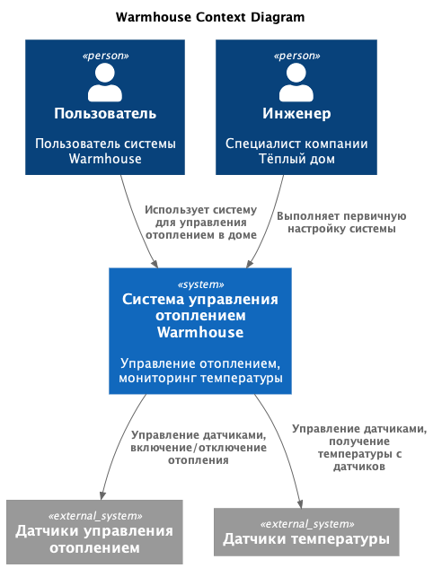
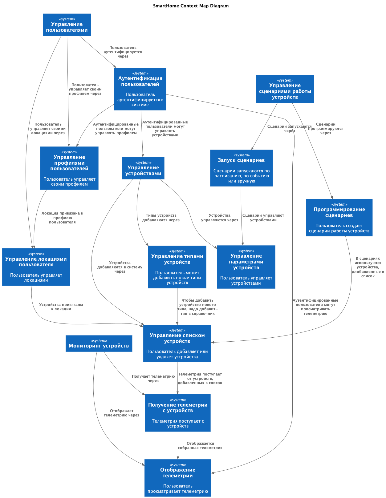
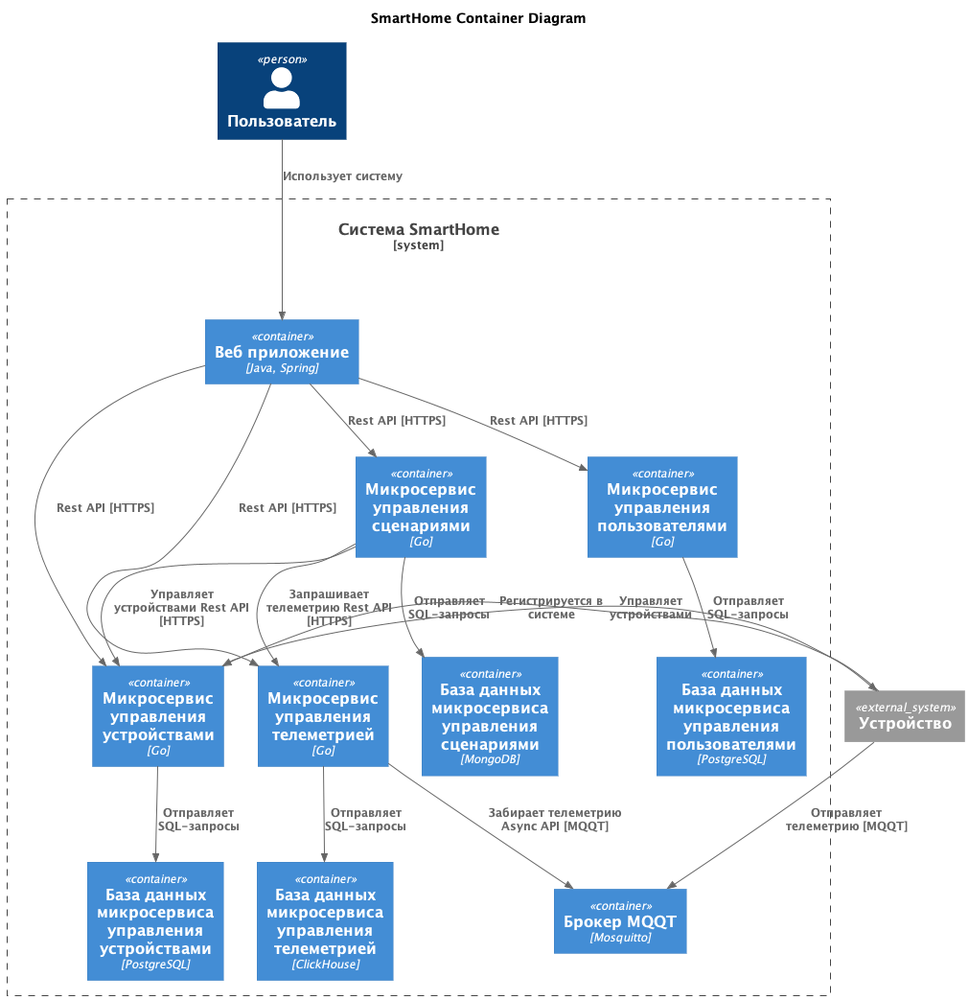
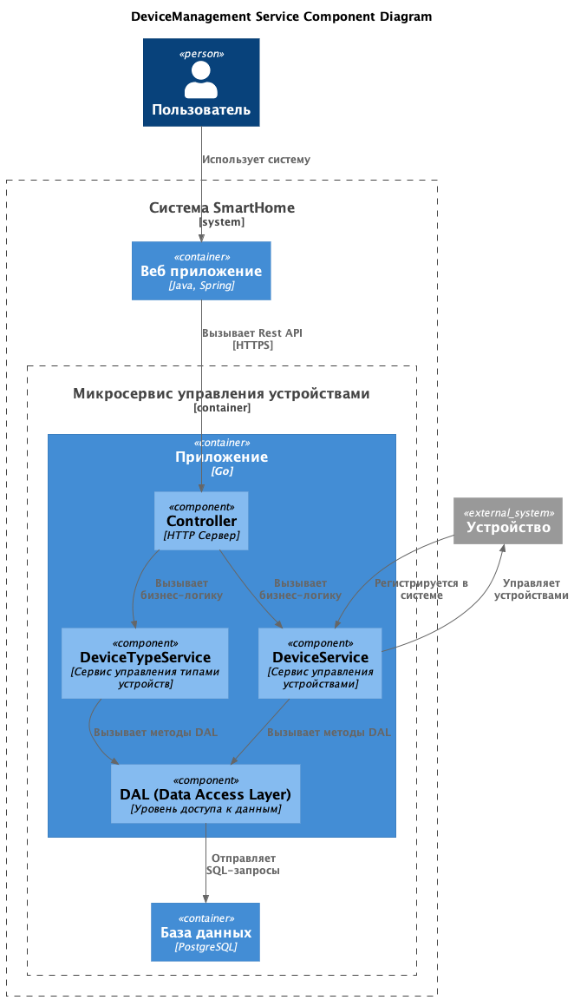
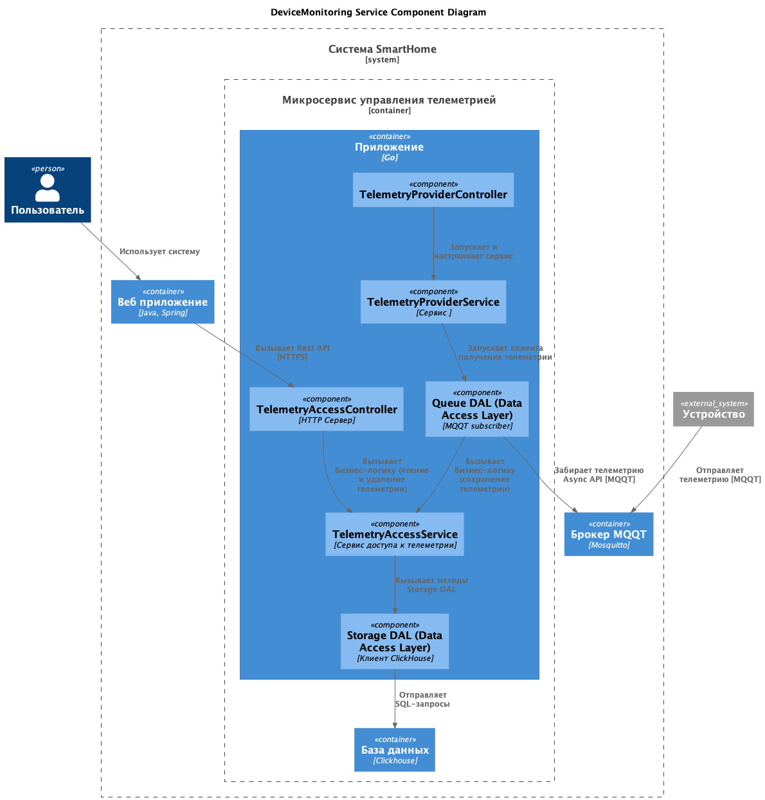
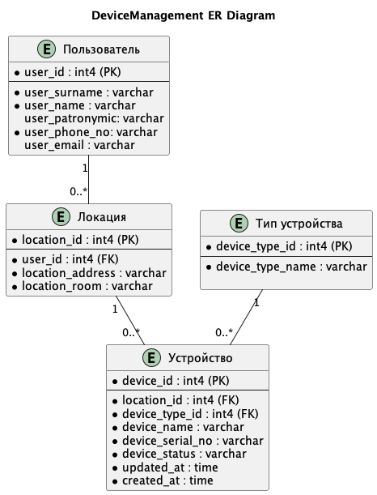

# Warmhouse

# Задание 1. Анализ и планирование

### 1. Описание функциональности монолитного приложения

**Управление отоплением:**

- Пользователи могут удалённо включать/выключать отопление в своих домах.
- Система поддерживает регистрацию датчиков управления отоплением при включении.
- Система поддерживает управление включением/выключением отопления.

**Мониторинг температуры:**

- Пользователи могут просматривать текущую температуру в своих домах через веб-интерфейс.
- Система поддерживает регистрацию датчиков температуры при включении.
- Система поддерживает получение данных о температуре с датчиков, установленных в домах.

### 2. Анализ архитектуры монолитного приложения
|||
|---------------------|-----------------------------|
|Язык программирования|Go|  
|База данных|PostgreSQL|
|Архитектура|Монолитная, все компоненты системы (обработка запросов, бизнес-логика, работа с данными) находятся в рамках одного приложения| 
|Взаимодействие|Синхронное, запросы обрабатываются последовательно|
|Масштабируемость|Ограничена, так как монолит сложно масштабировать по частям|
|Развертывание|Требует остановки всего приложения|

### 3. Определение доменов и границы контекстов

Домен: управление устройствами
- контекст: управления датчиками  

Домен: мониторинг устройств
- контекст: получения телеметрии с датчиков
- контекст: отображения телеметрии

### **4. Проблемы монолитного решения**

- Пользователи могут управлять только датчиками отопления.
- Пользователи могут мониторить только датчики температуры.
- Требуется установка специальных датчиков и реле, которые совместимы с системой.
- Пользователи не могут самостоятельно подключать даже совместимые датчики к системе, требуется выезд специалиста для настройки датчиков.
- Пользователи не могут самостоятельно программировать систему для управления различными модулями в соответствии со своими потребностями.
- Синхронное взаимодействие может стать узким местом при большом потоке данных с датчиков.
- Ограниченная масштабируемость монолитного приложения.
- Обновление отдельной функциональности требует остановки всего приложения.

### 5. Визуализация контекста системы — диаграмма С4

Диаграмма контекста системы Warmhouse приведена ниже:



# Задание 2. Проектирование микросервисной архитектуры

Новая система будет переименована в SmartHome поскольку будет управлять не только отоплением, но и любыми типами устройств.

## Выделение доменов, поддоменов и контекстов

* Домен: управление устройствами и сценариями их работы.  
	* поддомен управление устройствами  
		- контекст: управление типами устройств
		- контекст: управление списком устройств
		- контекст: управление параметрами устройства		
	* поддомен управление сценариями работы устройств
		- контекст: программирование сценариев
		- контекст: запуск сценариев
* Домен: мониторинг устройств
	- контекст: получение телеметрии с устройств
	- контекст: доступ к телеметрии
* Домен: управление пользователями
	- контекст: управление профилями пользователей
	- контекст: аутентификация пользователей
	- контекст: управление локациями пользователя


## Контекстная карта



## Определение микросервисов

* Управление устройствами
	* Микросевис управления устройствами
		- контекст: управление типами устройств
		- контекст: управление списком устройств
		- контекст: управление параметрами устройства	
	* Микросевис сценариями работы устройств
		- контекст: программирование сценариев
		- контекст: запуск сценариев	
* Мониторинг устройств
	* Микросервис управления телеметрией
		- контекст: получения телеметрии с устройств	  		
		- контекст: доступ к телеметрии
* Управление пользователями
	* Микросервис управления пользователями
		- контекст: управление профилями пользователей
		- контекст: аутентификация пользователей
		- контекст: управление локациями пользователя

## Описание архитектуры согласно модели C4

**Диаграмма контейнеров (Containers)**

Для получения телеметрии единственно правильным вариантом будет асинхронное взаимодействие, так как при синхронном взаимодействии сервис, принимающий метрики будет сильно перегружен, и метрики будут теряться. Подробнее о выборе вариантов взаимодействия будет описано в разделе *Задание 4. Создание и документирование API*. Поэтому следует добавить очередь сообщений для приема метрик от устройств. Микросервис управления телеметрией будет забирать метрики из очереди. Для получения данных телеметрии лучше использовать индустриальные протоколы из области IoT, например, протокол MQQT. Распространенным вариантов организации очереди, поддерживающей протокол MQQT, является MQQT-брокер [Eclipse Mosquitto](https://mosquitto.org/).  

Для хранения метрик лучше всего подходит колоночная база данных, например ClickHouse.

Сценарии управления устройствами можно сохранять в виде скриптов. Можно описывать скрипты в псевдокоде. Реализация пока не проработана, возможно это будет собственный или готовый язык сценариев или готовый движок сценариев. Использование реляционной базы данных для хранения таких сценариев не видится оправданным, предлагаю выбрать NoSQL-базу данных, которая позволит хранить данные гибкой структуры, например MongoDB.  

Целевая архитектура с учетом очереди:



**Диаграммы компонентов (Components)**

На этапе MVP будут разработаны только микросервисы управления устройствами и управления телеметрией. Функционал управления пользователями будет в усеченном виде реализован в микросервисе управления устройством, а после MVP вынесен в отдельный микросервис. 

Целевая архитектура сервисов с учетом отдельной реализации сервиса управления пользователями:



Сервис провайдера телеметрии (который принимает телеметрию с устройств) будет работать автономно, управление им через REST API запросы не предусмотрено, поэтому для него отдельный контроллер.




**Диаграмма кода (Code)**

Диаграмма классов для этапа MVP (сервис управления пользователями реализован в микросервисе управления устройством):


# Задание 3. Разработка ER-диаграммы

ER-диаграмма для этапа MVP (сервис управления пользователями реализован в микросервисе управления устройством):



# Задание 4. Создание и документирование API

### 1. Тип API

Для взаимодействия с **микросервисом управления устройствами (DeviceManagement)** и с компонентом **TelemetryViewerController микросервиса управления телеметрией (DeviceManagement)** будет использоваться RestAPI по следующим причинам:
- в ходе проектирования микросервисов и анализа взаимодействия между ними сложилась ресурсная модель, которая хорошо сочетается со стилем REST.
- минимальные затраты на разработку, так как это самый простой вариант API из рассматриваемых.
- в свою очередь не были выявлены кейсы, предполагающие сложные транзакционные взаимодействия, либо предполагающие ориентированность не на ресурсы, а на функции, поэтому я не вижу преимуществ использования для данных взаимодействий подходов, основанных на RPC.
- нет необходимости функционале других более сложных по реализации вариантов взаимодействия, таких как GraphQL, gRPC, WebSockets и т.д.

Однако для получения данных телеметрии лучше использовать индустриальные протоколы из области IoT, одним из самых распространенных является протокол MQQT. По этой причине для взаимодействия с компонентом TelemetryProviderController микросервиса управления телеметрией (DeviceManagement) будет использоваться асинхронный API, который обладает следующими преимуществами:
- совместимость с протоколом MQQT
- высокая производительность, масштабируемость и эффективность ресурсов, что требуется для приема интенсивного потока данных телеметрии.
- REST API из-за его синхронности не позволит принимать такие потоки данных в режиме реального времени.

### 2. Документация API

Спецификация Open API для микросервиса управления устройствами (DeviceManagement):   
[DeviceManagement Service OpenAPI](apps/device-management/api/device-management-spec.yaml)

Спецификация Open API для компонентов TelemetryAccess микросервиса управления телеметрией (DeviceMonitoring):   
[TelemetryAccess OpenAPI](apps/device-monitoring/api/telemetry-access/telemetry-access-spec.yaml)

Спецификация Acync API для компонентов TelemetryProvider микросервиса управления телеметрией (DeviceMonitoring):   
[TelemetryProvider Acync API](apps/device-monitoring/api/telemetry-provider/telemetry-provider-spec.yaml)

Примеры запросов и ответов не вижу смысла прикладывать, их много, при желании можно загрузить через Postman или Swagger Editor.

# Задание 5. Работа с docker и docker-compose

Задание выполнено, всё работает:
```
andrey@MacBook-Pro-Andrej apps % docker ps
CONTAINER ID   IMAGE                  COMMAND                  CREATED       STATUS                 PORTS                                         NAMES
2a69c26c2109   apps-app               "./smarthome"            3 hours ago   Up 3 hours             0.0.0.0:8080->8080/tcp, [::]:8080->8080/tcp   smarthome-app
2f22b728422e   postgres:16-alpine     "docker-entrypoint.s…"   3 hours ago   Up 3 hours (healthy)   5432/tcp                                      smarthome-postgres
cff63374c66c   apps-temperature-api   "./temperatureapi"       3 hours ago   Up 3 hours             0.0.0.0:8081->8081/tcp, [::]:8081->8081/tcp   temperature-api

andrey@MacBook-Pro-Andrej apps % curl 'http://localhost:8081/temperature?location=Bedroom'
{"description":"random value","location":"Bedroom","sensor_id":"2","sensor_type":"temperature","status":"active","timestamp":"2025-12-13T22:52:52.126988863Z","unit":"°C","value":25.659571635714983}

andrey@MacBook-Pro-Andrej apps % curl 'http://localhost:8081/temperature?location=Closet' 
{"description":"random value","location":"Unknown","sensor_id":"0","sensor_type":"temperature","status":"active","timestamp":"2025-12-13T22:52:56.094090075Z","unit":"°C","value":27.98531629515196}

andrey@MacBook-Pro-Andrej apps % curl 'http://localhost:8081/temperature/1'              
{"description":"random value","location":"Living Room","sensor_id":"1","sensor_type":"temperature","status":"active","timestamp":"2025-12-13T22:53:09.467567472Z","unit":"°C","value":19.314649024867343}                                        

andrey@MacBook-Pro-Andrej apps % curl 'http://localhost:8081/temperature/2'
{"description":"random value","location":"Bedroom","sensor_id":"2","sensor_type":"temperature","status":"active","timestamp":"2025-12-13T22:53:12.748655034Z","unit":"°C","value":3.0734336549642194}

andrey@MacBook-Pro-Andrej apps % curl 'http://localhost:8081/temperature/3'
{"description":"random value","location":"Kitchen","sensor_id":"3","sensor_type":"temperature","status":"active","timestamp":"2025-12-13T22:53:19.008654553Z","unit":"°C","value":27.442744670024744}

andrey@MacBook-Pro-Andrej apps % curl 'http://localhost:8081/temperature/4'
{"description":"random value","location":"Unknown","sensor_id":"0","sensor_type":"temperature","status":"active","timestamp":"2025-12-13T22:53:24.79583648Z","unit":"°C","value":22.065583668443004}%  
```

# **Задание 6. Разработка MVP**

MVP реализовано в сокращенном варианте:
* Контейнеры собираются и запускаются. 
* Новые микросервисы реализованы в виде скелета приложения, ошибок нет, приложение собирается и запускается. 
* Реализация компонентов (контроллер, сервисы и слой DAL) соответствует разработанным диаграммам С4. 
* Спецификации Open API были применены для кодогенерации, сгенерированный код по спекам используется в проекте. 
* Бизнес-логика и слой DAL Not Implemented, так как работа уже тянет на курсовую по программированию.
* Интеграция с монолитом реализована через очередь RabbitMQ, монолит при появлении обновлений по датчикам должен отправлять сообщения в очередь запущенного RabbitMQ и приниматься из этой очереди компонентом smarthome-integration. Предполагается, что smarthome-integration будет соответственно обновлять базу данных микросервиса. Таким образом будет обеспечена синхронизация с базой монолита на переходный период.
* В микросервисе device-monitoring в компоненте Telemetry Provider реализован прием сообщений из другой очереди RabbitMQ, куда должна поступать телеметрия. Принятые значения телеметрии должны сохраняться в базу ClickHouse.
* В микросервисе device-monitoring через HTTP Server реализован эндпойнт для чтения и удаления данных телеметрии из базы данных ClickHouse.
* C MQQT-брокером не разбирался, решил вместо него взять RabbitMQ.

```
andrey@MacBook-Pro-Andrej apps % docker ps                    
CONTAINER ID   IMAGE                          COMMAND                  CREATED         STATUS                   PORTS                                                                  NAMES
fc7030d860e7   apps-app                       "./smarthome"            2 minutes ago   Up 2 minutes             0.0.0.0:8080->8080/tcp, [::]:8080->8080/tcp                            smarthome-app
178ae6d38923   apps-device-management         "./devicemanagement"     2 minutes ago   Up 2 minutes             0.0.0.0:8082->8080/tcp, [::]:8082->8080/tcp                            device-management
63a5c1e164ab   apps-device-monitoring         "./devicemonitoring"     2 minutes ago   Up 2 minutes             0.0.0.0:8083->8080/tcp, [::]:8083->8080/tcp                            device-monitoring
5d6a5f64a592   rabbitmq:3-management-alpine   "docker-entrypoint.s…"   2 minutes ago   Up 2 minutes (healthy)   4369/tcp, 5671-5672/tcp, 15671-15672/tcp, 15691-15692/tcp, 25672/tcp   rabbitmq
80fcd1ca68b2   postgres:16-alpine             "docker-entrypoint.s…"   2 minutes ago   Up 2 minutes (healthy)   5432/tcp                                                               smarthome-postgres
a39b8c675418   apps-temperature-api           "./temperatureapi"       2 minutes ago   Up 2 minutes             0.0.0.0:8081->8081/tcp, [::]:8081->8081/tcp                            temperature-api
```